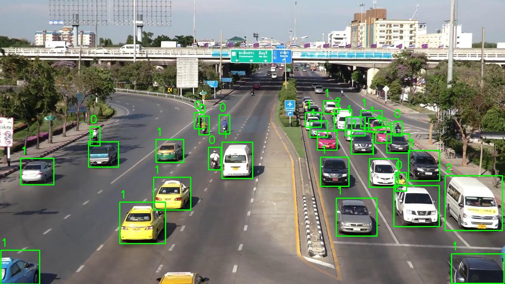

# Traffic-Vehicle-Detection-BKAI

Developed a traffic vehicle detection system using YOLO models and image processing techniques, with custom architecture modifications (DySample, C2f_DWRSeg, ...) to improve performance.

## Preview Result



## Dataset Preparation

Link data: https://drive.google.com/drive/u/0/folders/18OdCMZes7MT_YuZqyCs_4QTPXt1EV4Up?safe=strict

### Handle Unbalanced Classes

I addressed the issue of unbalanced classes using the `YoloWeightedDataset`, ensuring better representation of minority classes.

## Custom Model Architectures

The architectures were modified to include the following components:

- DySample
- DyHead
- C2f\_DWRSeg
- C3k2\_DWRSeg
- ResBlock
- CBAM

You can find the implementation of these components in the `ultralytics/nn/modules` and `ultralytics/nn/extra_modules` directories.

You can also find the configuration files for the custom YOLO models in the `config_model` directory.

## How to Run (Read the Tutorial.ipynb for more details)

1. Create a virtual environment and install the required packages:
    
    ```bash
    conda create -n VehicleDetection python=3.11.9
    conda activate VehicleDetection
    pip install -r requirements.txt
    ```

2. Download the dataset and split it into training and validation sets.

    ```bash
    !python split_dataset_tvt.py --train 90 --validation 10 --folder root_data/train --dest data/train_dataset
    ```

3. Add file `data.yaml` to the `data/train_dataset` folder with the following content:

    ```yaml
    path: /your/project/path/

    train: data/train_dataset/images/train
    val: data/train_dataset/images/val
    test: root_data/public_test

    # Class Names
    names: ['xe máy', 'xe ô tô con', 'Xe vận tải du lịch (xe khách)', 'Xe vận tải container']

    nc: 4
    names:
    0: xe máy
    1: xe ô tô con
    2: Xe vận tải du lịch (xe khách)
    3: Xe vận tải container
    ```

4. Train the model using the following command:

    ```bash
    !python start_train.py --yaml config_model/yolov8/yolov8l-DySample.yaml --model yolov8l.pt --data data/train_dataset/data.yaml --name yolov8l_DySample
    ```
5. (Optional) You can resume training using the following command:

    ```bash
    !python resume_train.py --model ./runs/train/yolov8l_DySample/weights/last.pt
    ```

6. Evaluate the model on the test set (public test) using the following command:

    ```bash
    !python validation.py --model runs/train/yolov8l_DySample/weights/best.pt --split test --data_dir data/train_dataset/data.yaml --name yolov8_DySample_test
    ```
